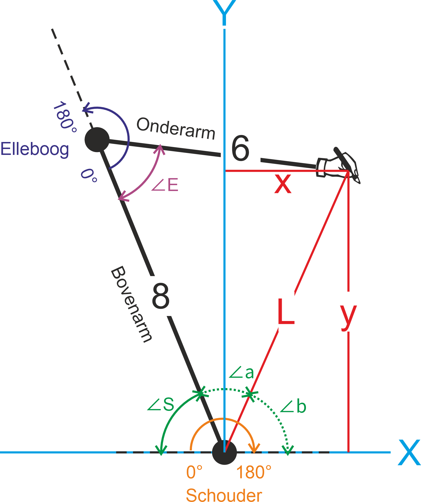
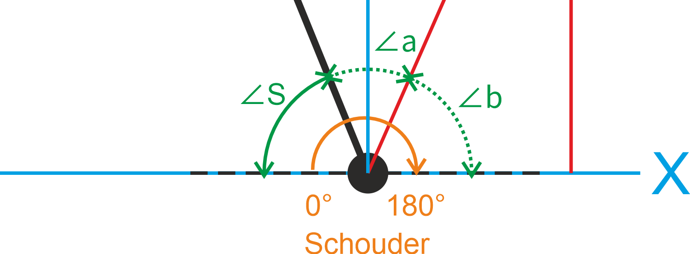

# Van xy-coördinaten naar servohoeken

**LET OP: DIT IS NOG NIET GETEST!**

Met de twee servo’s kunnen we de pen naar elk punt op het papier bewegen. De servo’s bewegen de armen in draaiende bewegingen. Om de pen uiteindelijk een rechte lijn te laten tekenen, moeten we voor meerdere xy-punten steeds de juiste hoeken berekenen. Hier komt wat goniometrie bij kijken.
Meetkundig ziet de situatie er zo uit:



* De schouderservo bevindt zich op punt (0,0) en heeft een draaibereik van 180° **rechtsom**
* De elleboogservo zit tussen de bovenarm (8 cm) en de onderarm (6 cm) en heeft ook een draaibereik van 180°. Omdat deze servo op de kop is gemonteerd is de draairichting **linksom**
* De pen staat op het coördinaat (x,y)

## Uitdaging
De uitdaging is nu om een algoritme te bedenken waarmee we bij een xy-coördinaat de hoek van de schouderservo **∠S** en van de elleboogservo **∠E** kunnen bepalen.

Als eerste hebben we hiervoor de afstand **L** van de pen (x,y) tot de schouderservo (0,0) nodig. Dit kan met de **stelling van Pythagoras**:

$$
L = \sqrt{x^2+y^2}
$$

In Python ziet dat er zo uit:

```python
import math

L = math.sqrt(x**2 + y**2)
```

Nu we **L** weten kunnen we alle hoeken bepalen. Dit gaat met de **cosinusregel**:

$$
C = \cos^{-1}\left(\frac{a^2+b^2-c^2}{2 \cdot a \cdot b}\right)
$$

Hierin is *cos<sup>-1</sup>* het 'omgekeerde' van de cosinus. Vaak wordt dit aangeduid met *arccos*. In Python is dit *math.acos(x)*.

Met deze regel kun je iedere hoek in een driehoek bepalen als de lengtes van de drie zijden bekend zijn.
Hierboven is C de hoek die tegenover zijde c ligt.
In Python doe je dit zo:

```python
import math

a = 8
b = 8
c = 10

waarde = (a**2 + b**2 - c**2) / (2 * a * b)

hoek = math.acos(waarde)
hoek_graden = math.degrees(hoek)

print(hoek_graden)
```

Aan het einde van de code wordt *hoek* (in radialen) omgezet naar *hoek_graden*.

## Hoek elleboog
Als we kijken naar de elleboogservo dan zien we dat de hoek **∠E** zich in een driehoek bevindt van de bovenarm (8 cm), onderarm (6 cm) en L. In formule vorm ziet dit er zo uit:

$$
\angle E = \arccos\left(\frac{L_{bovenarm}^2 + L_{onderarm}^2 - L^2}{2 \cdot L_{bovenarm} \cdot L_{onderarm}}\right)
$$

Als we de lengtes van de armen invullen en op de plaats van **L** de eerdere stelling van Pythagoras zetten, blijft dit over:

$$
\angle E = \arccos\left(\frac{100 - x^2 - y^2}{96}\right)
$$

```python
import math

hoek_E = math.degrees(
    math.acos((100 - x**2 - y**2) / 96)
)
```
## Hoek schouder
Voor het berekenen van de hoek van de schouderservo moeten we iets meer stappen maken, maar veel meer dan (twee keer) de cosinusregel hebben we niet nodig. Hier een detail van de tekening van het draaipunt rond de schouderservo.



De hoek van de schouder **∠S** is 180° min (hoek **∠a** + **∠b**)

De hoeken **∠a** en **∠b** kunnen we allebei berekenen met de cosinusregel:


### Cosinusregel voor ∠a

$$
\angle a = \cos^{-1}\left(\frac{L_{bovenarm}^2 + L^2 - L_{onderarm}^2}{2 \cdot L_{bovenarm} \cdot L}\right)
$$

Hierin vervangen we L door de eerdere stelling van Pythagoras:

$$
\angle a = \cos^{-1}\left(\frac{L_{bovenarm}^2 + (x^2+y^2) - L_{onderarm}^2}{2 \cdot L_{bovenarm} \cdot \sqrt{x^2+y^2}}\right)
$$

Als we nu de bekende lengtes van de armen invullen dan houden we dit over:

$$
\angle a = \cos^{-1}\left(\frac{x^2+y^2+28}{16\sqrt{x^2+y^2}}\right)
$$

In Python ziet het er zo uit:

```python
import math
L = math.sqrt(x**2 + y**2)
waarde = (x**2 + y**2 + 28) / (16 * L)
hoek_a = math.degrees(math.acos(waarde))
print(hoek_a)
```
### Cosinusregel voor ∠b

$$
\angle b = \arccos\left(\frac{L^2 + x^2 - y^2}{2 \cdot L \cdot x}\right)
$$

Als we hierin Pythagoras invullen dan kan er veel worden weggestreept en blijft dit over:

$$
\angle b = \arccos\left(\frac{x}{\sqrt{x^2+y^2}}\right)
$$

Dit is de hoek met de x-as.

In Python gaat dit zo:
```python
import math
hoek_b = math.degrees(
    math.acos(x / math.sqrt(x**2 + y**2))
)
```
### Berekening ∠S
De hoek van de schouder **∠S** is 180° - (**∠a** + **∠b**)

$$
\angle S = 180^\circ - \angle a - \angle b
$$

De code voor het bepalen van de hoek van de schouderservo is dan:

```python
import math

# lengte van lijn naar doelpunt
L = math.sqrt(x**2 + y**2)

# hoek a
hoek_a = math.degrees(
    math.acos(
        (x**2 + y**2 + 28)
        / (16 * L)
    )
)

# hoek b
hoek_b = math.degrees(
    math.acos(x / L)
)

# schouderhoek
hoek_S = 180 - hoek_a - hoek_b

print(hoek_S)
```
## Functies in Python
In dit geval is het handig om de berekening van de hoeken in twee functies op te nemen in het programma:

```python
import math


def bereken_ellebooghoek(x, y):
    """
    Berekent de hoek van de elleboogservo (∠E)
    op basis van het punt (x, y).
    """
    waarde = (100 - x**2 - y**2) / 96
    hoek_E = math.degrees(math.acos(waarde))
    return hoek_E


def bereken_schouderhoek(x, y):
    """
    Berekent de hoek van de schouderservo (∠S)
    op basis van het punt (x, y).
    """
    L = math.sqrt(x**2 + y**2)

    waarde_a = (x**2 + y**2 + 28) / (16 * L)
    hoek_a = math.degrees(math.acos(waarde_a))

    waarde_b = x / L
    hoek_b = math.degrees(math.acos(waarde_b))

    hoek_S = 180 - hoek_a - hoek_b
    return hoek_S
```

Deze kan je dan zo gebruiken:

```python
x = 5
y = 6

schouderhoek = bereken_schouderhoek(x, y)
ellebooghoek = bereken_ellebooghoek(x, y)

print("Schouder:", schouderhoek)
print("Elleboog:", ellebooghoek)
```
